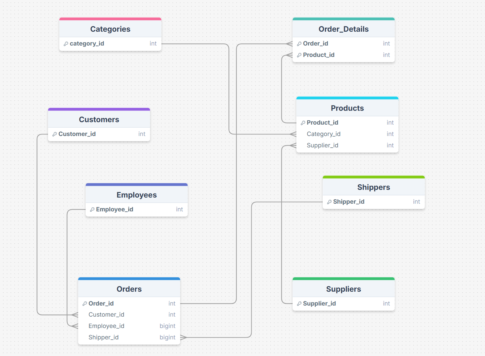

# Kiwilytics — Retail Database ERD

The **Entity-Relationship Diagram (ERD)** for the Kiwilytics retail sales database — the schema that powers my data engineering projects, including the [ETL Pipeline with Apache Airflow](https://github.com/Marwanmh/ETL-Airflow-Project).

## Schema Overview

A classic retail/order-management design with 8 entities:

| Table | Key(s) | Purpose |
|-------|--------|---------|
| `Customers` | `Customer_id` | Customers placing orders |
| `Employees` | `Employee_id` | Employees handling orders |
| `Orders` | `Order_id` | Order headers — links customer, employee, and shipper |
| `Order_Details` | `Order_id`, `Product_id` | Line items — junction table between orders and products |
| `Products` | `Product_id` | Product catalog — links to category and supplier |
| `Categories` | `category_id` | Product categories |
| `Suppliers` | `Supplier_id` | Product suppliers |
| `Shippers` | `Shipper_id` | Shipping companies fulfilling orders |

## Key Relationships

- **Customers → Orders** — one customer places many orders
- **Employees → Orders** — one employee handles many orders
- **Shippers → Orders** — one shipper delivers many orders
- **Orders ↔ Products** — many-to-many, resolved through the `Order_Details` junction table
- **Categories → Products** — one category contains many products
- **Suppliers → Products** — one supplier provides many products

## Design Notes

- `Order_Details` uses a composite key (`Order_id`, `Product_id`) so each product appears once per order.
- Lookup entities (`Categories`, `Suppliers`, `Shippers`) are normalized into their own tables to avoid duplication in `Products` and `Orders`.

## Related Projects

- [ETL-Airflow-Project](https://github.com/Marwanmh/ETL-Airflow-Project) — Airflow ETL pipeline built on the `orders`, `order_details`, and `products` tables of this schema

## License

Released under the [MIT License](LICENSE).
